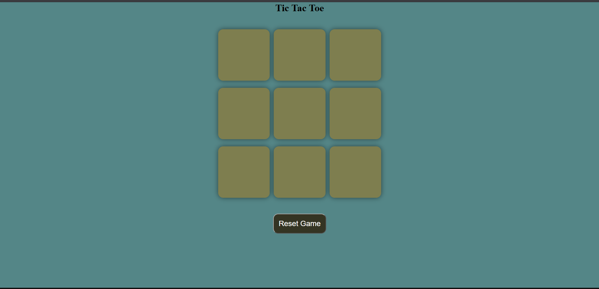
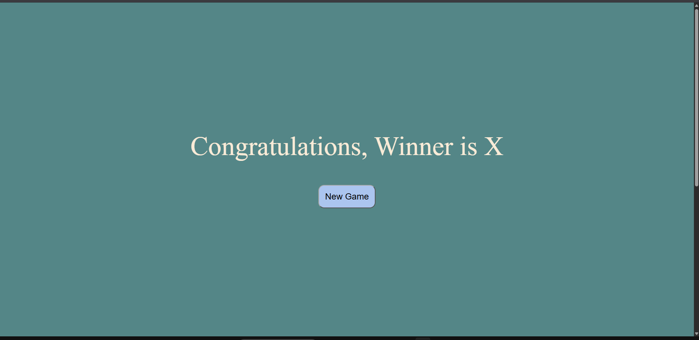

# 🎮 Tic Tac Toe Game

A simple, interactive and responsive **Tic Tac Toe game** built using **HTML, CSS and JavaScript**.

This project is designed as a beginner-friendly web development project to practice **DOM manipulation, JavaScript event handling, game logic, CSS Flexbox and responsive design**.

---

## 🚀 Live Demo

🔗 **[Play Tic Tac Toe](YOUR_LIVE_DEMO_LINK_HERE)**

> Replace `[Play_Tic_Tac_Toe](https://sanjayk6367.github.io/Tic_Tac_Toe_Game/)` with your GitHub Pages / Netlify / Vercel live project link.

---

## 📸 Screenshots

### 🎮 Game Interface



### 🏆 Winner Screen



> 📌 **Where to attach screenshots:**
> Create a folder named `screenshots` inside your project repository and put your images there:
>
> ```text
> Tic-Tac-Toe/
> │
> ├── index.html
> ├── style.css
> ├── script.js
> │
> ├── screenshots/
> │   ├── game-board.png
> │   └── winner-screen.png
> │
> └── README.md
> ```
>
> Then the README image paths above will automatically display the screenshots on GitHub.

---

## ✨ Features

* 🎯 Interactive 3×3 Tic Tac Toe board
* 👥 Two-player gameplay
* ❌ X and ⭕ O turns
* 🏆 Automatic winner detection
* 🔒 Board locks after a winner is detected
* 🔄 New Game functionality
* ♻️ Reset Game functionality
* 📱 Responsive game board
* 🎨 Clean and simple user interface
* ⚡ Fast and lightweight — no external libraries required

---

## 🛠️ Technologies Used

| Technology     | Purpose                               |
| -------------- | ------------------------------------- |
| **HTML5**      | Game structure and UI                 |
| **CSS3**       | Styling, layout and responsive design |
| **JavaScript** | Game logic and DOM manipulation       |

---

## 🧠 How the Game Works

The game uses JavaScript to control the turns and determine the winner.

### 1. Player Turns

The game starts with **O**.

```javascript
let turnO = true;
```

When a player clicks a box, the current player's symbol is inserted and the turn changes to the other player.

```text
O → X → O → X → O ...
```

---

### 2. Winning Patterns

The game checks all possible winning combinations on the 3×3 board.

There are **8 possible winning patterns**:

```text
[0, 1, 2]    [0, 3, 6]
[0, 4, 8]    [1, 4, 7]
[2, 5, 8]    [2, 4, 6]
[3, 4, 5]    [6, 7, 8]
```

The JavaScript checks whether all three positions in any pattern contain the same symbol.

---

### 3. Winner Detection

If the values of the three positions are equal and not empty, the game declares the winner.

```javascript
if(pos1Val === pos2Val && pos2Val === pos3Val){
    showWinner(pos1Val);
}
```

---

### 4. Reset Game

The **Reset Game** and **New Game** buttons reset the board and allow the players to start again.

```javascript
const resetGame = () => {
    turnO = true;
    enableBoxes();
    msgContainer.classList.add("hide");
}
```

---

## 🎨 UI & Responsive Design

The game board uses **CSS Flexbox** to arrange the nine boxes.

The board and boxes use `vmin` units so that the game can adapt to different screen sizes.

```css
.game {
    display: flex;
    flex-wrap: wrap;
    justify-content: center;
    align-items: center;
    gap: 1.5vmin;
}
```

The individual game boxes also use responsive dimensions:

```css
.box {
    height: 18vmin;
    width: 18vmin;
}
```

---

## 📂 Project Structure

```text
Tic-Tac-Toe/
│
├── index.html
├── style.css
├── script.js
│
├── screenshots/
│   ├── game-board.png
│   └── winner-screen.png
│
└── README.md
```

---

## ▶️ How to Run

### 1. Clone the Repository

```bash
git clone YOUR_REPOSITORY_URL
```

### 2. Open the Project

Open the project folder in **VS Code** or any code editor.

### 3. Run the Game

Open:

```text
index.html
```

in your web browser.

You can also use the **Live Server** extension in VS Code for a better development experience.

---

## 🎮 How to Play

1. Player **O** starts the game.
2. Click any empty box.
3. Player **X** gets the next turn.
4. Continue taking turns.
5. Get three identical symbols in a row to win.
6. Use **New Game** or **Reset Game** to start again.

---

## 🔮 Future Improvements

Some features that can be added in future versions:

* 🤖 Single-player mode with AI
* 🧠 Easy / Medium / Hard difficulty
* 🏆 Score tracking
* 🌙 Dark / Light mode
* 🔊 Sound effects
* ✨ Winning animation
* 🎨 More advanced UI
* 📱 Improved mobile experience
* 🥇 Match history
* 👤 Player name customization

---

## 📚 What I Learned

While building this project, I practiced:

* HTML page structure
* CSS Flexbox
* Responsive units such as `vmin`
* JavaScript DOM manipulation
* Event listeners
* Conditional statements
* Arrays
* Loops
* Functions
* Game logic
* Button interactions
* Basic UI/UX design

---

## 👨‍💻 Author

**Sanjay Kumawat**

Built with ❤️ using **HTML, CSS & JavaScript**.

---

## ⭐ Support

If you found this project useful or interesting, consider giving the repository a ⭐ on GitHub!

---

### 📌 Project Status

**Completed ✅**

More features and UI improvements may be added in future versions.
